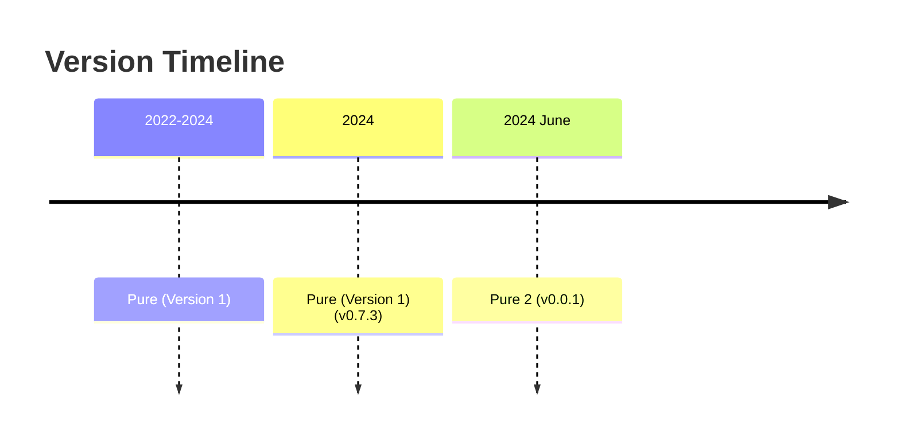

# Pure 2 - Lightweight Native C# Scripting (Now part of the Parcel NExT Platform⚡)

THIS IMPLEMENTATION IS A WORK-IN-PROGRESS AS OF 2024-06-09.

<!-- Pending video tutorial series on Pure's YouTube channel! -->

Pure 2 is a lightweight C# scripting platform with modern C# 12 syntax and support for easy Nuget import. Pure is based on Roslyn. In addition to base .Net runtime functionalities, Pure offers some standard libraries for quickly dealing with common tasks, and provides a handy scripting (REPL and Notebook) interface, plus a place where people can share their [snippets](https://github.com/Pure-the-Language/CentralSnippets). Pure 2 is conceptually similar to [Pure](https://github.com/Pure-the-Language/Pure) but will be architecturally very different - it directly builds upon Parcel NExT's Ama runtime.

Pure 2 uses C# 12 and is similar to [top-level statements](https://learn.microsoft.com/en-us/dotnet/csharp/fundamentals/program-structure/top-level-statements) in C#, with the following features:

1. You can define types and functions anywhere in the middle of the script.
2. Pure has its own package import behaviors (default namespace using, and package lookup rules).
1. Default global scope Math functions, and default using of System.IO and System.Linq
2. Top level function and variable definitions, in addition to classes and all other common constructs of C#
3. Making simple and common things simpler
4. Macros to support text-based parsing, file inclusion and module import.

Features:

* Single-word package names.
* On-prompto package invokation (through `Import`).
* Pure uses `PUREPATH` to search for scripts when using `Include` and when executing script file directly from command line as the first argument.
* Pure is very lightweight and will always be a thin layer on top of existing Roslyn/.Net runtime.

Pure is designed for very short snippets and getting everyday tasks done quicker.

I have highlighted the difference/advantage compared to traditional programming/scripting platforms:

|Platform|Pure|C#|Python|PowerShell|Perl|Pure 2|
|-|-|-|-|-|-|-|
|Installation Size|Required [.Net 8 (ASP.Net) Runtime](https://dotnet.microsoft.com/en-us/download/dotnet/8.0); Distributable is around 100Mb|Proper development with an IDE (Visual Studio or IntelliJ) takes forever to install.|Too many versions.|Super easy to install and use.|Super lightweight and fast.||
|Stability|C# .Net 8 based, will probably never change, very stable (depends on underlying C#); Very little new language constructs. Easily migratable to proper C#|Very stable as long as one doesn't bother GUI.|Fairly stable.|Fairly stable.|(PENDING)||
|Package Management/Functionalities|Zero-hassle package management and functionalities import; Single-file throughout.|Many button-clicks (in IDE) or commands or csproj file modification to install pckages. Self-contained dependancy environment; Fast and lightweight.|Package management is troublesome, messy distributable/end script environments.|Batteries packed and I think generally bad idea to import additional non-official functionalities.|(PENDING)|POS-compliant.|
|Summary|Provides most efficient short-snippet authoring capabilities.|Best for strongly typed and highly articulated solutions.|Lack of advanced language constructs; Ubiquitous support.|Good process automation; Syntax not suited for efficient OOP programming.|(PENIDNG)||

Certain macros/syntax are provided to implement language level scripting constructs:

|Macro/Syntax|Function|Remark|
|-|-|-|
|`Import()`|Import modules from PATH, and automatically download packages from NuGet|Must be on its own line|
|`Include()`|transclude scripts from file path|Must be on its own line; At the moment it's only safe to include from the top-level, one must assume we cannot have another `include` within included files, otherwise the behavior might be undeterministic, see [issue](https://github.com/Pure-the-Language/Pure/issues/24)|
|`Help(name)`|Get help about namespaces, types, and specific variables||
|Expresison evaluation|For single line assignment and variable creation, no need to append `;` at end of line - for script files, it must be properly formatted|Only applicable at REPL|



## Notebook Program

Besides `Pure.exe`, there is a separate `Notebook.exe` which provides jupyter notebook like interface for easier debugging and development.

The Notebook interface is only usable for Window - but one can easily develop one for other desktop environments using cross-platform techniques. I didn't bother because I am the only one using Pure.  
WARNING: Notice Pure is not for you if you - 1) Need to run and maintain outdated code base that's reluctant to adapt new C# features; 2) Have strong dependancies on custom libraries or legacy codes; 3) Can only use .Net Framework; 4) Need to stick with a single runtime version for long time. In those circumstances, Pure is not for you because Pure will always be updated to latest .Net runtime and backward compatibility is one of the least concern when it comes to adapting new features (though some level of "stability" is apparently assumed).

## Migration from Pure (Version 1)

Pure 2 will NOT be backward compatible with Pure! However it's likely Pure will be forward compatible with Pure 2 to some extent.

PENDING MIGRATION NOTES.

## Installation & Source Build

The source code can be built on Windows/Linux with .Net 8 SDK.

* To use on Windows, just download prebuilt executables from [Release](./releases/latest).
* To build on Linux, either try `PublishAll.ps1` (require `pwsh`), or just do `dotnet publish Frontends/Pure/Pure.csproj --use-current-runtime --output Publish`.

## Create a Library for Use in Pure

<!-- Keywords: Library Development -->

There are three types of ready-to-use libraries for Pure:

* Any regular C# Net 8 DLL, as published on [Nuget](https://www.nuget.org/). May work with older versions of .Net Core dlls but use discretion; May even also work with .Net Framework dlls but I observed occassions when behaviors are unpredictable.
* Any user-authored scripts that may be included using `Inlcude` macro.
* Any user-shared snippets published on [Central Snippets](https://github.com/Pure-the-Language/CentralSnippets) or similar places.

The intended usage scenario of Pure is like this:

* Pure provides a complete syntax and all of the standard features of .Net 8 runtime (C# 12)
* On top of the basics, Pure provides some standard libraries to further streamline common tasks
* On top of that, Pure provides native support for library importing (using `Import()`) and scripting importing (using `Include()`)
* When extending existing functionalities of Pure or simply developing libraries around re-usable code, a developer would write actual C# Class Library projects and expose those as DLLs for end consumption in Pure.

As such, to create a library for Pure is very easy - just like creating any standard C# library. By default, when importing in Pure, all namespaces of the DLL module containing public classes will be imported.

Libraries can provide rich runtime behavior by adopting those conventions (none of which requires a dependency on Pure 2's runtime), which take effect during Import using `Import()`:

1. When a static class named `Main` is provided inside the library assembly, all its static members will be made available globally;
2. If a static class name `Pure2LibraryOptions` is provided, there are a few parameters one can use to alter library loading behavior: 1) `public static bool DefaultNamespaceImport = true` Specifies whether we should import all namespaces containing public classes by default; 2) `public static string[] TopLevelClasses = ["Main"]` Specifies which classes should expose all its members at import time, this is equivalent to or an alternative to using `Main` (useful when we have multiple classes which we wish to export names at global level).

**Troubleshooting**

Pure is written in Net 8. However, when loading external DLLs, it's currently only safe to assume only Net Standard 2.0 and maybe Net Core 3.1 contexts are supported out-of-the-box (i.e. just loading Net 8 dlls may not work right away). For instance, `System.Data.Odbc` will throw exception "Platform not Supported" even though the platform (e.g. win64) is supported - it's the runtime that's causing the issue. A temporary workaround is when developing plugin/libraries, all plugins should target Net Standard 2.0+ or Net Core 3.1+ or Net Framework 4.6.1+. In reality, the issue is NOT within Net 8 as hosting context - THE RUNTIME IS INDEED 8.0.0 (within Roslyn), and [CSharpREPL](https://github.com/waf/CSharpRepl) (our reference interpreter) can consume System.Data.Odbc without problem (in the case of .Net 7), so we should be able to load Net 8 assemblies, it's just due to the way we handle DLL loading, we need to **load exactly the correct DLL** and cannot load an "entry" dll. We can use CSharpREPL to find the correct DLL that we need (e.g. for ODBC targeting .Net 7, it should be `AppData\Roaming\.csharprepl\packages\System.Data.Odbc.7.0.0\runtimes\win\lib\net7.0\System.Data.Odbc.dll`). In practice, when looking at the temporary dotnet build solution, one can find specific dlls under a `runtimes` folder.

System.Drawing is not (directly) supported on this platform. Notice the scenario is like that when using ODBC libraries - likely because it has many runtime versions. This is because at the moment "Import" cannot properly make use of the likely-redirection dlls. One solution for this is to select specific runtime when build instead of target "Portable" runtime. When trying to import modules, Pure will notify the user about such scenarios.

Library authoring requirements: Note that any (plug-in) libraries being authored CANNOT (and thus should not) directly target (or indirectly target) *.Net 8 Windows* because the hosting environment (aka. Pure) target *.Net 8* (without specifying windows as target). The solution for this is to isolate such components and trigger as sub-process (so some sort of data tranmission or IPC is needed).

## Visual Studio Development (Full C# Projects)

For quick iterative on-demand development, it's recommended to use [Notebook](./Frontends/Notebook/) for that purpose.

For slightly more involved scripts, one can use Visual Studio for debugging purpose. (For more advanced applications, it's recommended to use proper C#). Notice it's recommended to keep everything in single file and do not commit csproj and sln files to version control.

Create a C# Console project with .Net 8 while making sure *Do not use top level statements* is toggled off. (If you use command line, you can also just do `dotnet new console` in the script folder)


It's optional to specify `<Nullable>disable</Nullable>` in `.csproj` file if you don't want to handle `null` values, as shown below:


To reference Pure libraries in this environment, you just need to setup Nuget source to point to the installation folder of Pure, which contains a folder of Nugets.


Afterwards, installing packages is just like with any other C# project.


After this setup, you are able to write and debug Pure scripts directly in Visual Studio:


Notice there are a few notable differences:

1. You will not be able to use `Import`, which automatically finds the library and sets the static `using`.
2. C# top level statements require type definitions (e.g. records) at the bottom of all other functions and statements, while in Pure you can do it anywhere.
3. You need to explicitly state `using static System.Console;` in order to expose those names to the file scope, while in Pure this is done automatically.

Here is the complete script:

```c#
// Notice `Import(PackageName)` macro is only available in Pure
Import(ODBC)
using static System.Console;
using static ODBC.Main;

DSN = "SQLITE";
Row[] rows = Select<Row>("""
    SELECT *
    FROM MyTable
    """);
foreach (var row in rows)
    WriteLine(row.Name);
public record Row(string Name, double Value);
```

When converting C# projects to Pure scripts, note the following differences:

```C#
// Import(ODBC)

using static System.Console;
using static ODBC.Main;

// Include(MyScript.cs)
string[] Arguments = new string[] { "--help" };
```

Where, 

1. `Import()` and `Include()` doesn't work, but one can use Nuget and project files to achieve the same effect.
2. `using` statements must be at the top of the script in both C# and Pure.
3. One needs to define an auxiliary `string[] Arguments` which is supplemented by Pure otherwise.

A video instruction is available for [converting Pure scripts into C# projects](https://youtu.be/cMwUXAynZcs?si=5I_qjP2B21R4mrdv).